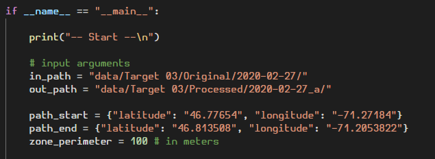
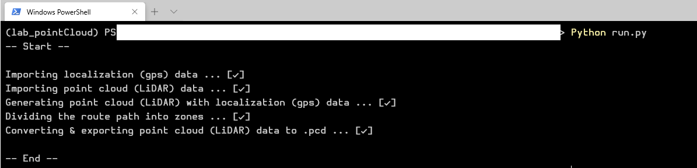

# PointCloudData

***A simple python script to import the data generated by the BRITE application. Then, exporting the point cloud data (.pcd) labeled by zones using a specific perimeter value and localization (gps) data.***

---

## Table of Contents

- [Installation](#installation)
- [Built With](#built-with)
- [Basic Usage](#basic-usage)
- [Features](#features)
- [Contributing](#contributing)
- [License](#license)

---

## Installation

> **Important** : *there is no need for installation.*

In order to use it, you must follow these steps:

1. Clone the repository `https://github.com/yyaddaden/PointCloudData`,
2. Extract all the Python files,
3. Open the command line prompt,
4. Use it with the instructions below (see [Basic Usage](#basic-usage)).

## Built With

This projet is built using these technologies:

- Programming Language: **Python**
- Libraries: 
  - **Geopy**: https://github.com/geopy/geopy
  - **Open3D**: https://github.com/intel-isl/Open3D
  - **Numpy**: https://github.com/numpy/numpy
- Code Editor: **Microsoft Visual Studio Code**

> **Important** : *the libraries listed above must be installed in order to use the script.*

## Basic Usage

In order to use the script, five different parameters must be set in the `run.py` file (see the screenshot below):

1. The input folder to find the raw data (generated by BRITE),
2. The output folder where will be stored the generated files (by zones),
3. The starting gps coordinates of the route path,
4. The ending gps coordinates of the route path,
5. The perimeter value (in meters).

The last step is to launch the `run.py` file as shown in the screenshot below:

## Features

This Python script includes several features:

1. Importing raw data generated from BRITE (localization data (.csv) & point cloud data (.obj)),
2. Associating localization data with point cloud data using the datetime,
3. Computing the list of point cloud files by zones according to the provided perimeter,
4. Exporting resultant data to an  organized dataset (.pcd).

## Contributing

> In order to contribue to this projet, there are two options :

- **Option 1** : 🍴 Fork this repo!
- **Option 2** : 👯 Clone this repo to your local machine using `https://github.com/yyaddaden/PointCloudData.git`

## License

